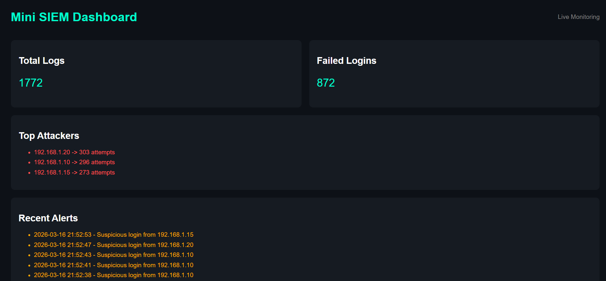

# Mini SIEM – Log Monitoring & Intrusion Detection System

## Demo

This project simulates a SIEM system that:
- Generates logs
- Detects brute-force attacks
- Displays real-time insights in a dashboard

## Overview

Mini SIEM is a simplified Security Information and Event Management system that simulates log generation, detects brute-force attacks, and visualizes security insights through a dashboard.

---

## Features

- Log generation (simulated system logs)
- Detection of brute-force login attacks
- Log storage using SQLite database
- SQL-based analysis (top attacking IPs)
- Dashboard with:
  - Total logs
  - Failed login attempts
  - Top attackers
  - Recent alerts
- Auto-refreshing dashboard (near real-time monitoring)

---

## Architecture

Log Generator → Log File → Log Collector → Database → Detection Engine → Dashboard

---

## Tech Stack

- Python
- SQLite
- HTML/CSS
- SQL

---

## How to Run

1. Start log generator:
   ```bash
   py logs/logs_generator.py
2. Store logs in database: 
   py collector/log_collector.py
3. Run detection engine:
   py detection/detect_attack.py
4. Generate dashboard:
   py dashboard/dashboard.py
5. Open:
   dashboard/dashboard.html

## Detection Logic

The system detects brute-force attacks by tracking repeated failed login attempts from the same IP address. If attempts exceed a threshold, an alert is triggered.

## Future Improvements

1. Real-time streaming dashboard (Flash/Node.js)
2. GeoIP attacker visualization
3. Advanced anomaly detection
4. Log correlation rules

## Output Example

1. Top attackers ranked by failed attempts 
2. Recent alerts showing suspicious attacks 
3. Live dashboard with auto-refresh

## Dashboard Preview




## Note

This is a simplified SIEM system built for educational purposes and does not represent full-scale enterprise SIEM solutions like Splunk or Elastic SIEM

